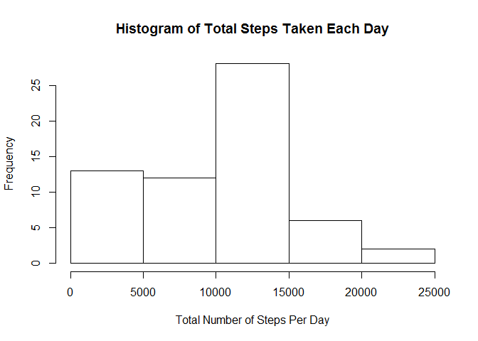
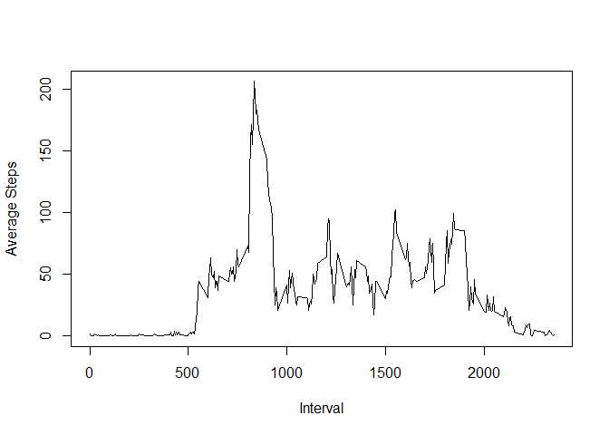
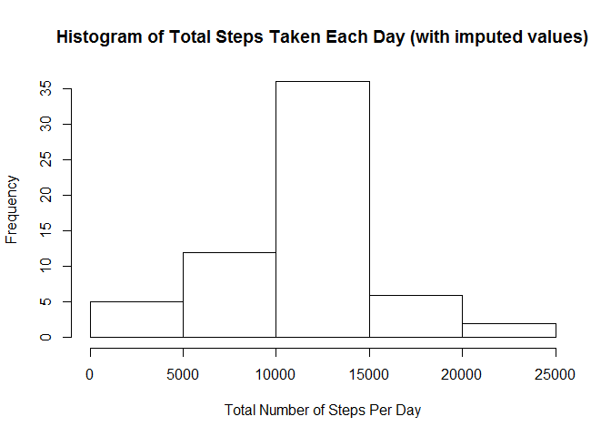
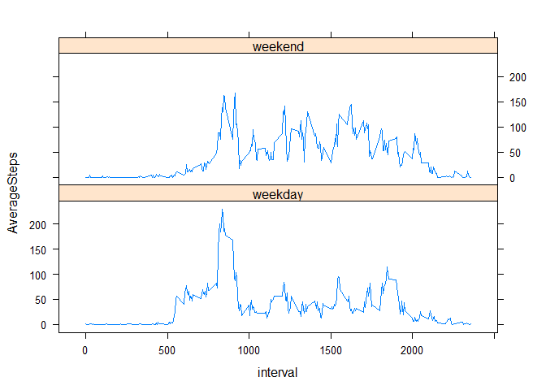

# Reproducible Research: Peer Assessment 1


### Load the data

```r
data <- read.csv("activity.csv", stringsAsFactors = FALSE)
```

### Calculate total steps and plot a histogram of total steps taken each day. Find the mean and median of total steps taken per day.

```r
totalSteps <- aggregate(data$steps, by = list(x=data$date), FUN = sum, na.rm = TRUE)
colnames(totalSteps) <- c("Date","TotalSteps")
hist(totalSteps$TotalSteps, xlab = "Total Number of Steps Per Day", ylab = "Frequency", main = "Histogram of Total Steps Taken Each Day")
```

<!-- -->

```r
## find the mean and median of total steps
meanOfTotalSteps <- round(mean(totalSteps$TotalSteps), 0)
medianOfTotalSteps <- median(totalSteps$TotalSteps)
```
The mean and median of total number of steps taken per day are **9354** and **10395** respectively.

### Find and plot average daily activity pattern

```r
## using an anonymous function and rounding off the mean values as decimals in number of steps isn't meaningful
averageSteps <- aggregate(data$steps, by = list(x=data$interval), FUN = function(x){round(mean(x, na.rm = TRUE),0)})
colnames(averageSteps) <- c("Interval", "AverageSteps")
with(averageSteps, plot(Interval, AverageSteps, type = "l", xlab = "Interval", ylab = "Average Steps"))
```

<!-- -->

```r
maxAverageSteps <- averageSteps[which.max(averageSteps$AverageSteps),]
```
**835** is the 5-minute interval with the maximum number of average steps

### Calculate the number of missing values

```r
countOfNaRows <- nrow(subset(data, is.na(data$steps)))
```
The number of rows with NA values is **2304**

### Impute missing values and plot a histogram of total number of steps taken each day

```r
## use the average steps in an interval to impute missing values in a matching interval
imputedData <- data
for(i in 1:nrow(data)) {
  if(is.na(data[i,]$steps)) {
    imputedData[i,]$steps <- averageSteps[averageSteps$Interval == data[i,]$interval,]$AverageSteps
  }
}
totalStepsRevised <- aggregate(imputedData$steps, by = list(x=imputedData$date), FUN = sum, na.rm = TRUE)
colnames(totalStepsRevised) <- c("Date","TotalSteps")
hist(totalStepsRevised$TotalSteps, xlab = "Total Number of Steps Per Day", ylab = "Frequency", main = "Histogram of Total Steps Taken Each Day (with imputed values)")
```

<!-- -->

```r
revisedMeanOfTotalSteps <- round(mean(totalStepsRevised$TotalSteps), 0)
revisedMedianOfTotalSteps <- median(totalStepsRevised$TotalSteps)
```
The mean and median of total number of steps taken per day after imputing the missing values are **10766** and **10762** respectively. As can be seen from these values, both the mean and median have increased after imputing the missing values.

### Plot to determine if there are differences in activity patterns between weekdays and weekends

```r
imputedData <- mutate(imputedData, day = as.factor(ifelse(weekdays(as.POSIXct(imputedData$date, format= "%Y-%m-%d")) %in% c("Saturday","Sunday"), "weekend", "weekday")))
summary <- imputedData %>% group_by(day, interval) %>% summarize(AverageSteps = round(mean(steps), 0))
## plot the average steps by interval for weekdays and weekend using the lattice plotting system
xyplot(AverageSteps ~ interval | day, data = summary, layout = c(1,2), type = "l")
```

<!-- -->
